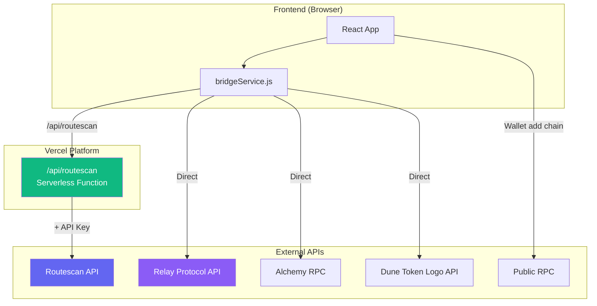
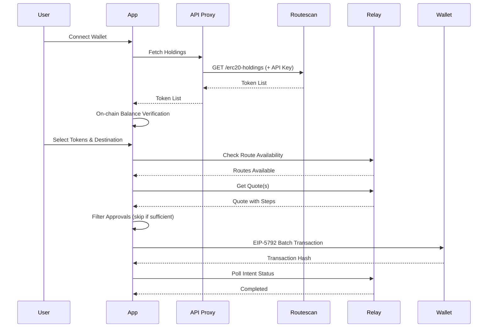

<h1 align="center">BatchBridge</h1>

[](./LICENSE)
[](https://batchbridge.vercel.app)
[](https://react.dev)
[](https://vitejs.dev)
[](https://relay.link)

Batch swap and bridge multiple tokens into a single output token using Relay Protocol, with a single EIP-5792 batch transaction.

## Features

- Multi-token batch swaps/bridges in a single wallet call (EIP-5792)
- Same-chain and cross-chain routes with Relay Protocol
- Token holdings discovery with on-chain verification
- Route availability checks before quoting
- Automatic approval skipping when allowance is already sufficient
- Price impact filtering for low-liquidity tokens
- **Transfer fee token detection** - Blocks fee-on-transfer tokens that may fail
- Status polling using Relay intents
- Relay step execution (transaction + signature steps)
- Wallet detection for explicit deposits (EOA vs smart wallet/EIP-7702)
- **Custom token support** via Relay `/currencies/v2` API
- **RPC batching** via viem multicall for efficient on-chain queries
- Secure API proxy to protect API keys

## Architecture



## Supported Chains

- Ethereum (1)
- Base (8453)
- Arbitrum (42161)

To add more chains, update:
- `frontend/src/wagmi.js` (networks + RPCs)
- `frontend/src/bridgeService.js` (RPC selection)
- `frontend/src/wagmi.js` `BRIDGE_CHAINS` and `COMMON_TOKENS`

## Wallet Requirements

This app uses EIP-5792 (Wallet Call API) for batching when supported. Wallets that do not support `wallet_sendCalls` fall back to sequential transactions.

> **💡 Recommended Wallets:** For the true batch transaction experience, use **OKX Wallet** or **Ambire Wallet** - they fully support EIP-5792 batch calls, allowing all swaps and approvals to execute in a single transaction.

Public RPC URLs are used for wallet network addition prompts to avoid origin restrictions.

## Tech Stack

- React + Vite
- wagmi + viem
- Reown AppKit (WalletConnect)
- Relay Protocol APIs
- Routescan API for holdings (proxied via serverless function)
- Alchemy RPC for on-chain multicall verification
- Public RPC for wallet network add prompts
- Dune token logo API for token icons

## Environment Variables

Create `frontend/.env`:

```env
VITE_WALLETCONNECT_PROJECT_ID=your_walletconnect_project_id
VITE_ALCHEMY_API_KEY=your_alchemy_api_key
ROUTESCAN_API_KEY=your_routescan_api_key
```

| Variable | Scope | Description |
|----------|-------|-------------|
| `VITE_WALLETCONNECT_PROJECT_ID` | Client | WalletConnect project ID |
| `VITE_ALCHEMY_API_KEY` | Client | Alchemy API key for RPC calls |
| `ROUTESCAN_API_KEY` | Server | Routescan API key (never exposed to client) |

## How It Works



### Step-by-Step Flow

1. **Wallet Connection**
   - Reown AppKit connects the wallet via WalletConnect

2. **Fetch Holdings**
   - Request goes through `/api/routescan` proxy
   - Proxy adds API key server-side and forwards to Routescan
   - Response filtered for valid symbols and non-zero USD value

3. **On-chain Verification**
   - viem `multicall` verifies balances using Alchemy RPC

4. **Route Availability**
   - Relay price API: `POST https://api.relay.link/price`
   - Checks if route exists for token and destination currency

5. **Quote Creation**
   - Single token: `POST https://api.relay.link/quote/v2`
   - Multi-token same-chain: Multiple `quote/v2` calls aggregated client-side
   - Multi-token cross-chain: `POST https://api.relay.link/execute/swap/multi-input`
   - Tokens with price impact >15% are excluded

6. **Approval Filtering**
   - Approve steps decoded and checked against current allowances
   - If allowance sufficient, approve steps removed before execution

7. **Execution (Batch Transaction)**
   - All approve + swap/deposit steps sent in single EIP-5792 batch via `useSendCalls`

8. **Status Tracking**
   - Each step includes status endpoint: `GET https://api.relay.link/intents/status/v3?requestId=...`
   - UI polls these endpoints to show progress

## API Integrations

| Service | Endpoints | Purpose |
|---------|-----------|---------|
| **Relay** | `/quote/v2`, `/execute/swap/multi-input`, `/price`, `/currencies/v2`, `/intents/status/v3` | Quotes, execution, token metadata, status |
| **Routescan** | `/v2/network/mainnet/evm/{chainId}/address/{address}/erc20-holdings` | Token holdings (via proxy) |
| **Alchemy** | JSON-RPC | Multicall balance verification |
| **Public RPC** | JSON-RPC | Wallet network add prompts |
| **Dune** | `/beta/token/logo/{chainId}/{tokenAddress}` | Token logos |

## Project Structure

```
├── api/
│   └── routescan.js        # Vercel serverless function (API proxy)
├── frontend/
│   ├── src/
│   │   ├── App.jsx         # Main application
│   │   ├── bridgeService.js # API calls & business logic
│   │   ├── wagmi.js        # Wallet configuration
│   │   └── index.css       # Styles
│   ├── public/             # Static assets
│   ├── .env                # Environment variables
│   └── vite.config.js      # Vite config with dev proxy
└── vercel.json             # Vercel deployment config
```

## Local Development

```bash
cd frontend
npm install
npm run dev
```

The Vite dev server proxies `/api/routescan` requests to Routescan API, adding the API key from `ROUTESCAN_API_KEY` environment variable.

## Vercel Deployment

1. Push code to GitHub
2. Import project in Vercel
3. Set environment variables in Vercel Dashboard:
   - `VITE_WALLETCONNECT_PROJECT_ID`
   - `VITE_ALCHEMY_API_KEY`
   - `ROUTESCAN_API_KEY` (server-side, not exposed to client)
4. Deploy

The `vercel.json` is pre-configured to:
- Build from `frontend/` directory
- Output to `frontend/dist`
- Route `/api/*` to serverless functions in `api/`

## FAQ

### Is this bridge secure?

**Yes.** BatchBridge is a frontend interface only. All core bridging functionality is handled by [Relay Protocol](https://relay.link):

| Component | Handled By | Notes |
|-----------|------------|-------|
| Token custody | **Relay Protocol** | We never hold user funds |
| Cross-chain messaging | **Relay Protocol** | Secure solver network with MEV protection |
| Swap execution | **Relay Protocol** | Audited smart contracts |
| Price discovery | **Relay Protocol** | Real-time quotes from multiple sources |
| Transaction signing | **User's Wallet** | We never access private keys |

### What does BatchBridge actually do?

BatchBridge is a **UI layer** that:
- Fetches your token holdings (read-only)
- Helps you select tokens and amounts
- Requests quotes from Relay Protocol
- Batches multiple swap calls into one wallet transaction (EIP-5792)
- Displays transaction status

### Are there any vulnerabilities I should know about?

We implement several safety measures:
- ✅ **Transfer fee token detection** - Blocks fee-on-transfer tokens that fail on Relay
- ✅ **Price impact limits** - Warns/blocks swaps with >15% price impact
- ✅ **Route availability checks** - Only shows tokens with valid routes
- ✅ **Approval filtering** - Skips unnecessary token approvals

**What we DON'T handle:**
- Smart contract security → Relay Protocol's audited contracts
- Cross-chain finality → Relay's solver network
- MEV protection → Relay Protocol
- Slippage execution → Relay Protocol

### Can you steal my funds?

**No.** This frontend:
- Never requests your private keys
- Never has custody of your tokens
- Only submits transactions YOU approve in your wallet
- Is fully open source for verification

## License

MIT
