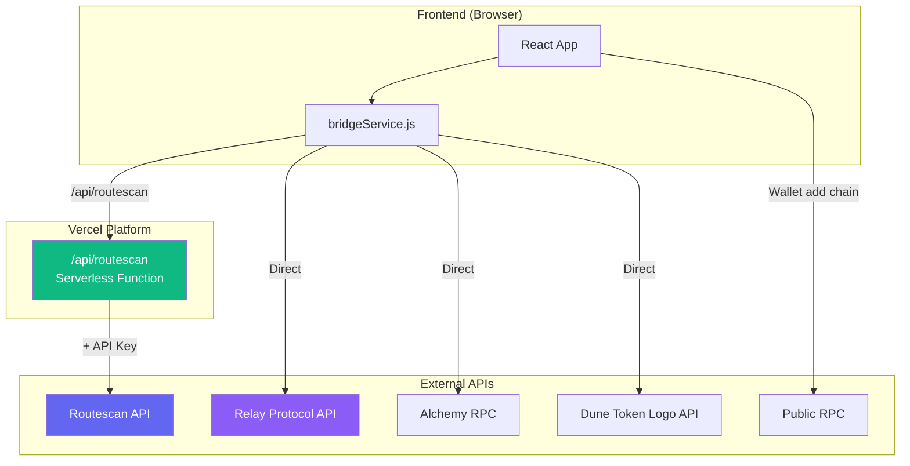
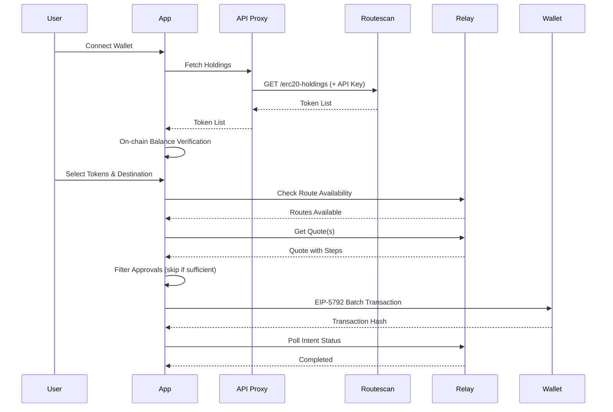

<h1 align="center">BatchBridge</h1>
LIVE WEBSITE: https://www.batchbridge.xyz/

[](./LICENSE)
[](https://batchbridge.vercel.app)
[](https://react.dev)
[](https://vitejs.dev)
[](https://relay.link)

Batch swap and bridge multiple tokens into a single output token using Relay Protocol, with a single EIP-5792 batch transaction.

## Features

- Multi-token batch swaps/bridges in a single wallet call (EIP-5792)
- Same-chain and cross-chain routes with Relay Protocol
- Token holdings discovery with on-chain verification
- Route availability checks before quoting
- Automatic approval skipping when allowance is already sufficient
- Price impact filtering for low-liquidity tokens
- **Transfer fee token detection** - Blocks fee-on-transfer tokens that may fail
- Status polling using Relay intents
- Relay step execution (transaction + signature steps)
- Wallet detection for explicit deposits (EOA vs smart wallet/EIP-7702)
- **Custom token support** via Relay `/currencies/v2` API
- **RPC batching** via viem multicall for efficient on-chain queries
- Secure API proxy to protect API keys

## Architecture


```mermaid
flowchart TB
    subgraph Client["Frontend (Browser)"]
        UI[React App]
        BS[bridgeService.js]
    end

    subgraph Vercel["Vercel Platform"]
        API["/api/routescan<br/>Serverless Function"]
    end

    subgraph External["External APIs"]
        RS[Routescan API]
        RL[Relay Protocol API]
        AL[Alchemy RPC]
        PR[Public RPC]
        DU[Dune Token Logo API]
    end

    UI --> BS
    BS -->|"/api/routescan"| API
    API -->|"+ API Key"| RS
    BS -->|Direct| RL
    BS -->|Direct| AL
    BS -->|Direct| DU
    UI -->|Wallet add chain| PR

    style API fill:#10b981,color:#fff
    style RS fill:#6366f1,color:#fff
    style RL fill:#8b5cf6,color:#fff
```

## Supported Chains

- Ethereum (1)
- Base (8453)
- Arbitrum (42161)

To add more chains, update:
- `frontend/src/wagmi.js` (networks + RPCs)
- `frontend/src/bridgeService.js` (RPC selection)
- `frontend/src/wagmi.js` `BRIDGE_CHAINS` and `COMMON_TOKENS`

## Wallet Requirements

This app uses EIP-5792 (Wallet Call API) for batching when supported. Wallets that do not support `wallet_sendCalls` fall back to sequential transactions.

> **💡 Recommended Wallets:** For the true batch transaction experience, use **OKX Wallet** or **Ambire Wallet** - they fully support EIP-5792 batch calls, allowing all swaps and approvals to execute in a single transaction.

Public RPC URLs are used for wallet network addition prompts to avoid origin restrictions.

## Tech Stack

- React + Vite
- wagmi + viem
- Reown AppKit (WalletConnect)
- Relay Protocol APIs
- Routescan API for holdings (proxied via serverless function)
- Alchemy RPC for on-chain multicall verification
- Public RPC for wallet network add prompts
- Dune token logo API for token icons

## Environment Variables

Create `frontend/.env`:

```env
VITE_WALLETCONNECT_PROJECT_ID=your_walletconnect_project_id
VITE_ALCHEMY_API_KEY=your_alchemy_api_key
ROUTESCAN_API_KEY=your_routescan_api_key
```

| Variable | Scope | Description |
|----------|-------|-------------|
| `VITE_WALLETCONNECT_PROJECT_ID` | Client | WalletConnect project ID |
| `VITE_ALCHEMY_API_KEY` | Client | Alchemy API key for RPC calls |
| `ROUTESCAN_API_KEY` | Server | Routescan API key (never exposed to client) |

## How It Works


```mermaid
sequenceDiagram
    participant User
    participant App
    participant Proxy as API Proxy
    participant Routescan
    participant Relay
    participant Wallet

    User->>App: Connect Wallet
    App->>Proxy: Fetch Holdings
    Proxy->>Routescan: GET /erc20-holdings (+ API Key)
    Routescan-->>Proxy: Token List
    Proxy-->>App: Token List
    App->>App: On-chain Balance Verification
    User->>App: Select Tokens & Destination
    App->>Relay: Check Route Availability
    Relay-->>App: Routes Available
    App->>Relay: Get Quote(s)
    Relay-->>App: Quote with Steps
    App->>App: Filter Approvals (skip if sufficient)
    App->>Wallet: EIP-5792 Batch Transaction
    Wallet-->>App: Transaction Hash
    App->>Relay: Poll Intent Status
    Relay-->>App: Completed
```

### Step-by-Step Flow

1. **Wallet Connection**
   - Reown AppKit connects the wallet via WalletConnect

2. **Fetch Holdings**
   - Request goes through `/api/routescan` proxy
   - Proxy adds API key server-side and forwards to Routescan
   - Response filtered for valid symbols and non-zero USD value

3. **On-chain Verification**
   - viem `multicall` verifies balances using Alchemy RPC

4. **Route Availability**
   - Relay price API: `POST https://api.relay.link/price`
   - Checks if route exists for token and destination currency

5. **Quote Creation**
   - Single token: `POST https://api.relay.link/quote/v2`
   - Multi-token same-chain: Multiple `quote/v2` calls aggregated client-side
   - Multi-token cross-chain: `POST https://api.relay.link/execute/swap/multi-input`
   - Tokens with price impact >15% are excluded

6. **Approval Filtering**
   - Approve steps decoded and checked against current allowances
   - If allowance sufficient, approve steps removed before execution

7. **Execution (Batch Transaction)**
   - All approve + swap/deposit steps sent in single EIP-5792 batch via `useSendCalls`

8. **Status Tracking**
   - Each step includes status endpoint: `GET https://api.relay.link/intents/status/v3?requestId=...`
   - UI polls these endpoints to show progress

## API Integrations

| Service | Endpoints | Purpose |
|---------|-----------|---------|
| **Relay** | `/quote/v2`, `/execute/swap/multi-input`, `/price`, `/currencies/v2`, `/intents/status/v3` | Quotes, execution, token metadata, status |
| **Routescan** | `/v2/network/mainnet/evm/{chainId}/address/{address}/erc20-holdings` | Token holdings (via proxy) |
| **Alchemy** | JSON-RPC | Multicall balance verification |
| **Public RPC** | JSON-RPC | Wallet network add prompts |
| **Dune** | `/beta/token/logo/{chainId}/{tokenAddress}` | Token logos |

## Project Structure

```
├── api/
│   └── routescan.js        # Vercel serverless function (API proxy)
├── frontend/
│   ├── src/
│   │   ├── App.jsx         # Main application
│   │   ├── bridgeService.js # API calls & business logic
│   │   ├── wagmi.js        # Wallet configuration
│   │   └── index.css       # Styles
│   ├── public/             # Static assets
│   ├── .env                # Environment variables
│   └── vite.config.js      # Vite config with dev proxy
└── vercel.json             # Vercel deployment config
```

## Local Development

```bash
cd frontend
npm install
npm run dev
```

The Vite dev server proxies `/api/routescan` requests to Routescan API, adding the API key from `ROUTESCAN_API_KEY` environment variable.

## Vercel Deployment

1. Push code to GitHub
2. Import project in Vercel
3. Set environment variables in Vercel Dashboard:
   - `VITE_WALLETCONNECT_PROJECT_ID`
   - `VITE_ALCHEMY_API_KEY`
   - `ROUTESCAN_API_KEY` (server-side, not exposed to client)
4. Deploy

The `vercel.json` is pre-configured to:
- Build from `frontend/` directory
- Output to `frontend/dist`
- Route `/api/*` to serverless functions in `api/`

## FAQ

### Is this bridge secure?

**Yes.** BatchBridge is a frontend interface only. All core bridging functionality is handled by [Relay Protocol](https://relay.link):

| Component | Handled By | Notes |
|-----------|------------|-------|
| Token custody | **Relay Protocol** | We never hold user funds |
| Cross-chain messaging | **Relay Protocol** | Secure solver network with MEV protection |
| Swap execution | **Relay Protocol** | Audited smart contracts |
| Price discovery | **Relay Protocol** | Real-time quotes from multiple sources |
| Transaction signing | **User's Wallet** | We never access private keys |

### What does BatchBridge actually do?

BatchBridge is a **UI layer** that:
- Fetches your token holdings (read-only)
- Helps you select tokens and amounts
- Requests quotes from Relay Protocol
- Batches multiple swap calls into one wallet transaction (EIP-5792)
- Displays transaction status

### Are there any vulnerabilities I should know about?

We implement several safety measures:
- ✅ **Transfer fee token detection** - Blocks fee-on-transfer tokens that fail on Relay
- ✅ **Price impact limits** - Warns/blocks swaps with >15% price impact
- ✅ **Route availability checks** - Only shows tokens with valid routes
- ✅ **Approval filtering** - Skips unnecessary token approvals

**What we DON'T handle:**
- Smart contract security → Relay Protocol's audited contracts
- Cross-chain finality → Relay's solver network
- MEV protection → Relay Protocol
- Slippage execution → Relay Protocol

### Can you steal my funds?

**No.** This frontend:
- Never requests your private keys
- Never has custody of your tokens
- Only submits transactions YOU approve in your wallet
- Is fully open source for verification

## License

MIT

---

# Base Mini App Integration

BatchBridge is fully integrated as a **Base Mini App**, allowing users to access the token bridge directly from Farcaster, Warpcast, and other Base-compatible platforms.

## Overview

Base Mini Apps are web applications that can be embedded within Farcaster clients, providing a seamless user experience for on-chain interactions. This integration enables BatchBridge to reach a wider audience within the crypto community.

## Prerequisites

Before starting the integration process, ensure you have:

1. ✅ **Deployed application** on Vercel: `https://www.batchbridge.xyz/`
2. ✅ **Publicly accessible** manifest: `https://www.batchbridge.xyz/.well-known/farcaster.json`
3. ✅ **Required images** in `frontend/public/`:
   - `icon.png` (512×512px)
   - `hero.png` (1200×630px)
   - `screenshot-portrait.png` (1080×1920px)
   - `og-image.png` (1200×630px)

## Integration Steps

### Step 1: Configure Base Mini App Manifest

Create `minikit.config.ts` in the project root:

```typescript
// minikit.config.ts - Base Mini App configuration
export const minikitConfig = {
  accountAssociation: {
    header: "eyJmaWQiOjE3MzE4LCJ0eXBlIjoiY3VzdG9keSIsImtleSI6IjB4NzYwQjA0NDc5NjM4MTExNzNmRjg3YjAzYzA5OEJBQ0YxNzNCYkU0OCJ9",
    payload: "eyJkb21haW4iOiJ4LWl0bGlzdC1xcy52ZXJjZWwuYXBwIn0",
    signature: "0xf4d37c6998420d3ceeca3b89ec2d2009920108ea51eab76027d22c505a7221f654bbdefd44d09cbcc66b67f4ff2ff8f345c85f6d7e5c7279cf0f8e068633acf1b"
  },
  miniapp: {
    name: "BatchBridge",
    iconUrl: "https://www.batchbridge.xyz/icon.png",
    heroImageUrl: "https://www.batchbridge.xyz/hero.png",
    splashImageUrl: "https://www.batchbridge.xyz/og-image.png",
    splashBackgroundColor: "#8B9E8B",
    homeUrl: "https://www.batchbridge.xyz/",
    description: "Bridge multiple tokens across Ethereum, Base, and Arbitrum in a single batch transaction",
    subtitle: "Multi-token cross-chain bridge",
    tagline: "Batch bridge tokens",
    primaryCategory: "finance",
    secondaryCategory: "tools",
    tags: ["defi", "bridge", "ethereum", "base", "arbitrum"],
    screenshotUrls: ["https://www.batchbridge.xyz/screenshot-portrait.png"],
    webhookUrl: "https://www.batchbridge.xyz/api/webhook",
    noindex: true
  }
} as const;
```

### Step 2: Generate accountAssociation Credentials

1. **Disable Vercel Authentication** in Vercel Dashboard → Settings → Deployment Protection
2. **Go to Base Build Account association tool**: https://base.org/build/account-association
3. **Enter your app URL**: `https://www.batchbridge.xyz/`
4. **Sign the manifest** with your Farcaster account
5. **Copy the generated credentials** (header, payload, signature)
6. **Update** `minikit.config.ts` with the new credentials

### Step 3: Create Manifest Files

Two manifest locations are required:

1. **Root directory**: `.well-known/farcaster.json` (for Base verification)
2. **Public directory**: `frontend/public/.well-known/farcaster.json` (for build output)

Use the included script to generate manifests:
```bash
npm run generate-manifest
```

Or manually create the manifest with this structure:
```json
{
  "accountAssociation": {
    "header": "...",
    "payload": "...",
    "signature": "..."
  },
  "frame": {
    "version": "1",
    "name": "BatchBridge",
    "iconUrl": "https://www.batchbridge.xyz/icon.png",
    "homeUrl": "https://www.batchbridge.xyz/",
    "imageUrl": "https://www.batchbridge.xyz/hero.png",
    "buttonTitle": "Launch Bridge",
    "splashImageUrl": "https://www.batchbridge.xyz/og-image.png",
    "splashBackgroundColor": "#8B9E8B",
    "webhookUrl": "https://www.batchbridge.xyz/api/webhook",
    "noindex": true,
    "primaryCategory": "finance",
    "tags": ["defi", "bridge", "ethereum", "base", "arbitrum"],
    "description": "Bridge multiple tokens across Ethereum, Base, and Arbitrum in a single batch transaction",
    "subtitle": "Multi-token cross-chain bridge",
    "tagline": "Batch bridge tokens",
    "screenshotUrls": ["https://www.batchbridge.xyz/screenshot-portrait.png"]
  }
}
```

### Step 4: Add Base Verification Meta Tag

Add the following meta tag to `frontend/index.html` inside the `<head>` section:

```html
<!-- Base Mini App Verification -->
<meta name="base:app_id" content="6973ae8b88e3bac59cf3d563" />
```

### Step 5: Configure Vercel Deployment

Update `vercel.json` to ensure proper headers and routing:

```json
{
  "buildCommand": "cd frontend && npm run build",
  "outputDirectory": "frontend/dist",
  "headers": [
    {
      "source": "/.well-known/(.*)",
      "headers": [
        { "key": "Access-Control-Allow-Origin", "value": "*" },
        { "key": "Content-Type", "value": "application/json" }
      ]
    }
  ]
}
```

### Step 6: Deploy and Verify

1. **Commit and push** changes to GitHub
2. **Monitor Vercel deployment**
3. **Verify manifest availability**: `https://www.batchbridge.xyz/.well-known/farcaster.json`
4. **Check meta tag presence** on homepage

## Testing in Base Preview

After deployment, test your integration:

1. **Open Base Preview**: https://base.dev/preview
2. **Enter your app URL**: `https://www.batchbridge.xyz/`
3. **Check all tabs**:
   - **Preview**: Verify app appearance and launch functionality
   - **Metadata**: Confirm all manifest fields are correctly loaded
   - **Account association**: Verify credentials are valid
   - **Frame validation**: Ensure frame structure is correct

### Common Test Scenarios:
- ✅ Wallet connection within embed
- ✅ Token selection and quote generation
- ✅ Responsive design on mobile/desktop
- ✅ Image loading (icon, hero, screenshot)
- ✅ No JavaScript/CORS errors

## Troubleshooting

### "Manifest not found" Error
- Check if `.well-known/farcaster.json` is publicly accessible
- Verify Vercel Authentication is disabled during credential generation
- Check CORS headers in `vercel.json`

### "Invalid signature" Error
- Ensure credentials in `minikit.config.ts` match generated values exactly
- Verify you're using the same Farcaster account for signing
- Regenerate credentials if needed

### "Images not loading"
- Confirm image URLs are correct and publicly accessible
- Check image dimensions meet requirements
- Verify file formats (PNG recommended)

### Base Verification Failed
- Ensure meta tag `<meta name="base:app_id" content="...">` is present in `<head>`
- Check that the app_id matches your Base Mini App ID
- Verify deployment is complete before testing

## Optimization for Base Mini App

### Performance
- **Bundle optimization**: Code splitting, tree shaking
- **Image optimization**: WebP format, proper compression
- **Caching**: Configure cache headers for static assets

### User Experience
- **Mobile-first design**: Optimize for 320px-768px viewports
- **Touch-friendly**: Minimum 44×44px interactive elements
- **Loading states**: Show progress during wallet interactions

### Security
- **CSP headers**: Content Security Policy for embed safety
- **Sandbox attributes**: Appropriate iframe sandboxing
- **Input validation**: Sanitize user inputs

## Additional Resources

- **Base Mini App Documentation**: https://docs.base.org/mini-apps/
- **Farcaster Frames Specification**: https://docs.farcaster.xyz/frames
- **Base Build Tools**: https://base.org/build
- **Vercel Deployment Guide**: https://vercel.com/docs

## Support

For issues with Base Mini App integration:
1. Check the [Base Discord](https://discord.gg/base) #mini-apps channel
2. Review deployment logs in Vercel Dashboard
3. Test with `base.dev/preview` diagnostic tools

---

*BatchBridge is now fully integrated as a Base Mini App and ready for the Farcaster community!*
