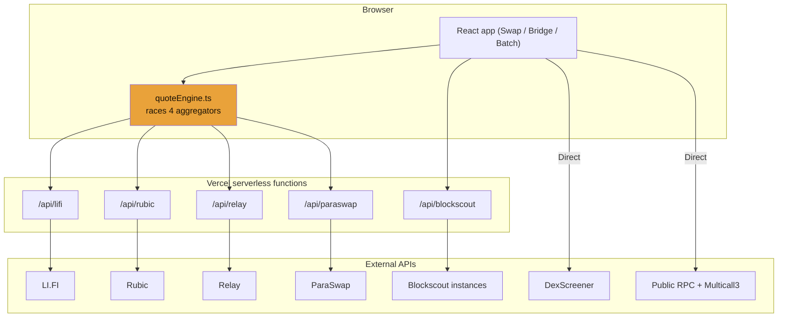
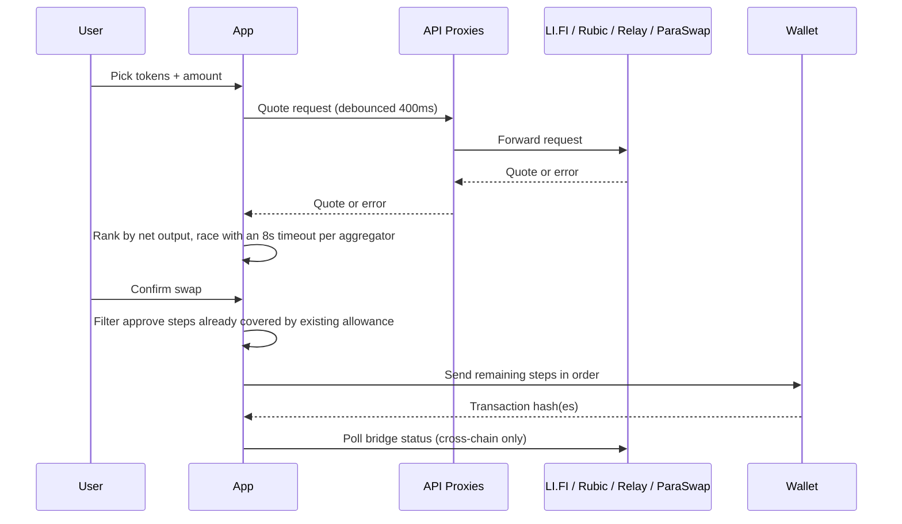

<h1 align="center">BatchBridge</h1>
LIVE WEBSITE: https://www.batchbridge.xyz/

[](./LICENSE)
[](https://batchbridge.vercel.app)
[](https://react.dev)
[](https://vitejs.dev)
[](https://www.typescriptlang.org)

A multi-chain DEX and bridge aggregator across 16 EVM chains, with no integrator fee. Three modes in one interface:

- **Swap** — any liquid token to any liquid token, same-chain or cross-chain (e.g. USDC on Base → a memecoin on Polygon)
- **Bridge** — the same asset moved between chains (e.g. ETH on Base → ETH on Ethereum)
- **Batch** — several tokens on one chain, consolidated into a single destination token in one operation (the original differentiator)

## Features

- 16 supported chains (see below), each with at least 2 public RPC endpoints for failover
- Swap quotes race 4 aggregators in parallel (LI.FI, Rubic, Relay, ParaSwap) and rank by net output after fees
- Bridge mode resolves the destination asset automatically via a hand-maintained bridgeable-token map
- Batch mode consolidates multiple held tokens into one destination token via Relay's multi-input endpoint
- Token holdings discovery via Blockscout, falling back to an on-chain Multicall3 balance check where Blockscout has no instance
- Transfer-fee token detection (fee-on-transfer tokens silently short the amount received and can make a swap revert)
- Automatic approval skipping when on-chain allowance is already sufficient
- Wrong-chain and insufficient-balance detection before submitting, not just after a revert
- Dark/light theme toggle, dark by default
- No integrator fee on any route

## Architecture


```mermaid
flowchart TB
    subgraph Client["Browser"]
        UI["React app (Swap / Bridge / Batch)"]
        QE["quoteEngine.ts<br/>races 4 aggregators"]
    end

    subgraph Vercel["Vercel serverless functions"]
        P1["/api/lifi"]
        P2["/api/rubic"]
        P3["/api/relay"]
        P4["/api/paraswap"]
        P5["/api/blockscout"]
    end

    subgraph External["External APIs"]
        LIFI[LI.FI]
        RUBIC[Rubic]
        RELAY[Relay]
        PARASWAP[ParaSwap]
        BLOCKSCOUT[Blockscout instances]
        DEXS[DexScreener]
        RPC["Public RPC + Multicall3"]
    end

    UI --> QE
    QE --> P1 --> LIFI
    QE --> P2 --> RUBIC
    QE --> P3 --> RELAY
    QE --> P4 --> PARASWAP
    UI --> P5 --> BLOCKSCOUT
    UI -->|Direct| DEXS
    UI -->|Direct| RPC

    style QE fill:#e9a23a,color:#1a1205
```

All 5 proxies exist only to keep each provider's own rate limits/CORS off the client, not to inject any paid API key — every provider used is free-tier.

## Supported Chains

Ethereum, Optimism, BNB Chain, Gnosis, Polygon, Fantom, zkSync Era, Mantle, Base, Mode, Arbitrum, Celo, Avalanche, Linea, Blast, Scroll.

Defined in [`src/config/chains.ts`](src/config/chains.ts) — each entry lists its RPC endpoints, explorer, Multicall3 address, and Blockscout instance (`null` where none exists publicly; those chains fall back to on-chain multicall for balance discovery). To add a chain, add an entry there and to the `networks` list built from it in [`src/wagmi.ts`](src/wagmi.ts) (wallet connect/switch-chain needs both).

## Tech Stack

- React + Vite + TypeScript (`strict` mode)
- Tailwind CSS 4 (`@tailwindcss/vite`), CSS custom properties as design tokens
- wagmi + viem for wallet/on-chain interaction, Reown AppKit for the connect modal
- TanStack Query for data fetching, TanStack Virtual for the long token list
- Vitest + Testing Library for tests
- Aggregators: LI.FI, Rubic, Relay, ParaSwap (swaps); DexScreener + LI.FI (prices/liquidity); Blockscout + public RPC/Multicall3 (balances) — all free-tier, no paid API keys anywhere

## Environment Variables

Create `.env` in the project root:

```env
VITE_WALLETCONNECT_PROJECT_ID=your_walletconnect_project_id
```

That's the only variable this app needs. It's the WalletConnect Cloud project ID Reown AppKit uses for the connect modal; get one at [cloud.reown.com](https://cloud.reown.com/).

## How Swap Mode Works


```mermaid
sequenceDiagram
    participant User
    participant App
    participant Proxies as API Proxies
    participant Aggregators as LI.FI / Rubic / Relay / ParaSwap
    participant Wallet

    User->>App: Pick tokens + amount
    App->>Proxies: Quote request (debounced 400ms)
    Proxies->>Aggregators: Forward request
    Aggregators-->>Proxies: Quote or error
    Proxies-->>App: Quote or error
    App->>App: Rank by net output, race with an 8s timeout per aggregator
    User->>App: Confirm swap
    App->>App: Filter approve steps already covered by existing allowance
    App->>Wallet: Send remaining steps in order
    Wallet-->>App: Transaction hash(es)
    App->>Aggregators: Poll bridge status (cross-chain only)
```

A single aggregator failing or timing out doesn't block the others — quotes only come back empty if every eligible aggregator fails, and the UI then distinguishes "no aggregator supports this chain pair" from "aggregators tried and found no liquidity."

## Project Structure

```
├── api/                      # Vercel serverless proxies (lifi, rubic, relay, paraswap, blockscout)
├── src/
│   ├── App.tsx                # Mode routing (?mode=swap|bridge|batch)
│   ├── wagmi.ts                # wagmi/Reown AppKit config, 16-chain network list
│   ├── config/
│   │   ├── chains.ts           # The 16 chains: RPCs, explorer, Multicall3, Blockscout
│   │   └── bridgeableAssets.ts # Bridge-mode's hand-maintained cross-chain asset map
│   ├── services/
│   │   ├── aggregators/        # One adapter per provider + quoteEngine.ts's race/rank
│   │   ├── balances.ts         # Blockscout + Multicall3 balance/holdings discovery
│   │   ├── tokenRegistry.ts    # Swap-mode's token list (LI.FI) + custom token lookup
│   │   ├── execution.ts        # Allowance checks, Relay status polling
│   │   ├── batchQuote.ts       # Batch mode's Relay multi-input quote
│   │   └── transferFee.ts      # Fee-on-transfer token detection
│   ├── hooks/                  # useQuote, useTokenList, useBalances, useSwapExecution, ...
│   └── components/
│       ├── swap/ bridge/ batch/ # One card per mode
│       ├── layout/              # Navbar (mode tabs, theme toggle, wallet button)
│       └── common/              # Button, Modal, TokenIcon, ChainIcon, ThemeToggle, ...
└── vercel.json
```

## Local Development

```bash
npm install
npm run dev
```

```bash
npm test          # vitest run
npx tsc --noEmit   # strict type-check
```

The `/api/*` proxies only run under `vercel dev` or an actual Vercel deployment — plain `vite dev` serves the SPA for everything else but can't execute serverless functions, so token lists and quotes won't resolve locally without one of those two.

## Vercel Deployment

1. Push to GitHub, import the project in Vercel
2. Set `VITE_WALLETCONNECT_PROJECT_ID` in the Vercel dashboard
3. Deploy — `vercel.json` already points the build at this repo's root and routes `/api/*` to the serverless functions in `api/`

## FAQ

### Is this safe to use?

BatchBridge is a frontend and quote-routing layer only — it never holds custody of your tokens. Swap/bridge execution itself is handled by whichever aggregator (LI.FI, Rubic, Relay, or ParaSwap) won the quote race for a given trade; their own contracts and solver networks execute the actual transfer. This app only:

- Reads your token balances (read-only, via Blockscout/public RPC)
- Requests and compares quotes from the 4 aggregators
- Builds the transaction(s) for you to sign — it never has your private keys and only submits what you approve in your wallet

### Why does the "Batch" tab still exist alongside Swap and Bridge?

Consolidating several tokens into one output in a single operation was BatchBridge's original differentiator, before this became a full multi-chain DEX. Swap and Bridge cover the general case; Batch stays for the specific "clean up several small balances at once" use case Relay's multi-input endpoint supports directly.

### Is there really no fee?

Correct — BatchBridge doesn't add an integrator fee on top of any aggregator's own quote. (Rubic's API defaults to a small integrator fee unless an explicit `integratorAddress` opts out of it; this app always passes that, and has a regression test guarding against it silently reappearing.)

## License

MIT

---

# Base Mini App Integration

BatchBridge is fully integrated as a **Base Mini App**, allowing users to access the token bridge directly from Farcaster, Warpcast, and other Base-compatible platforms.

## Overview

Base Mini Apps are web applications that can be embedded within Farcaster clients, providing a seamless user experience for on-chain interactions. This integration enables BatchBridge to reach a wider audience within the crypto community.

## Prerequisites

Before starting the integration process, ensure you have:

1. ✅ **Deployed application** on Vercel: `https://www.batchbridge.xyz/`
2. ✅ **Publicly accessible** manifest: `https://www.batchbridge.xyz/.well-known/farcaster.json`
3. ✅ **Required images** in `frontend/public/`:
   - `icon.png` (512×512px)
   - `hero.png` (1200×630px)
   - `screenshot-portrait.png` (1080×1920px)
   - `og-image.png` (1200×630px)

## Integration Steps

### Step 1: Configure Base Mini App Manifest

Create `minikit.config.ts` in the project root:

```typescript
// minikit.config.ts - Base Mini App configuration
export const minikitConfig = {
  accountAssociation: {
    header: "eyJmaWQiOjE3MzE4LCJ0eXBlIjoiY3VzdG9keSIsImtleSI6IjB4NzYwQjA0NDc5NjM4MTExNzNmRjg3YjAzYzA5OEJBQ0YxNzNCYkU0OCJ9",
    payload: "eyJkb21haW4iOiJ4LWl0bGlzdC1xcy52ZXJjZWwuYXBwIn0",
    signature: "0xf4d37c6998420d3ceeca3b89ec2d2009920108ea51eab76027d22c505a7221f654bbdefd44d09cbcc66b67f4ff2ff8f345c85f6d7e5c7279cf0f8e068633acf1b"
  },
  miniapp: {
    name: "BatchBridge",
    iconUrl: "https://www.batchbridge.xyz/icon.png",
    heroImageUrl: "https://www.batchbridge.xyz/hero.png",
    splashImageUrl: "https://www.batchbridge.xyz/og-image.png",
    splashBackgroundColor: "#8B9E8B",
    homeUrl: "https://www.batchbridge.xyz/",
    description: "Bridge multiple tokens across Ethereum, Base, and Arbitrum in a single batch transaction",
    subtitle: "Multi-token cross-chain bridge",
    tagline: "Batch bridge tokens",
    primaryCategory: "finance",
    secondaryCategory: "tools",
    tags: ["defi", "bridge", "ethereum", "base", "arbitrum"],
    screenshotUrls: ["https://www.batchbridge.xyz/screenshot-portrait.png"],
    webhookUrl: "https://www.batchbridge.xyz/api/webhook",
    noindex: true
  }
} as const;
```

### Step 2: Generate accountAssociation Credentials

1. **Disable Vercel Authentication** in Vercel Dashboard → Settings → Deployment Protection
2. **Go to Base Build Account association tool**: https://base.org/build/account-association
3. **Enter your app URL**: `https://www.batchbridge.xyz/`
4. **Sign the manifest** with your Farcaster account
5. **Copy the generated credentials** (header, payload, signature)
6. **Update** `minikit.config.ts` with the new credentials

### Step 3: Create Manifest Files

Two manifest locations are required:

1. **Root directory**: `.well-known/farcaster.json` (for Base verification)
2. **Public directory**: `frontend/public/.well-known/farcaster.json` (for build output)

Use the included script to generate manifests:
```bash
npm run generate-manifest
```

Or manually create the manifest with this structure:
```json
{
  "accountAssociation": {
    "header": "...",
    "payload": "...",
    "signature": "..."
  },
  "frame": {
    "version": "1",
    "name": "BatchBridge",
    "iconUrl": "https://www.batchbridge.xyz/icon.png",
    "homeUrl": "https://www.batchbridge.xyz/",
    "imageUrl": "https://www.batchbridge.xyz/hero.png",
    "buttonTitle": "Launch Bridge",
    "splashImageUrl": "https://www.batchbridge.xyz/og-image.png",
    "splashBackgroundColor": "#8B9E8B",
    "webhookUrl": "https://www.batchbridge.xyz/api/webhook",
    "noindex": true,
    "primaryCategory": "finance",
    "tags": ["defi", "bridge", "ethereum", "base", "arbitrum"],
    "description": "Bridge multiple tokens across Ethereum, Base, and Arbitrum in a single batch transaction",
    "subtitle": "Multi-token cross-chain bridge",
    "tagline": "Batch bridge tokens",
    "screenshotUrls": ["https://www.batchbridge.xyz/screenshot-portrait.png"]
  }
}
```

### Step 4: Add Base Verification Meta Tag

Add the following meta tag to `frontend/index.html` inside the `<head>` section:

```html
<!-- Base Mini App Verification -->
<meta name="base:app_id" content="6973ae8b88e3bac59cf3d563" />
```

### Step 5: Configure Vercel Deployment

Update `vercel.json` to ensure proper headers and routing:

```json
{
  "buildCommand": "cd frontend && npm run build",
  "outputDirectory": "frontend/dist",
  "headers": [
    {
      "source": "/.well-known/(.*)",
      "headers": [
        { "key": "Access-Control-Allow-Origin", "value": "*" },
        { "key": "Content-Type", "value": "application/json" }
      ]
    }
  ]
}
```

### Step 6: Deploy and Verify

1. **Commit and push** changes to GitHub
2. **Monitor Vercel deployment**
3. **Verify manifest availability**: `https://www.batchbridge.xyz/.well-known/farcaster.json`
4. **Check meta tag presence** on homepage

## Testing in Base Preview

After deployment, test your integration:

1. **Open Base Preview**: https://base.dev/preview
2. **Enter your app URL**: `https://www.batchbridge.xyz/`
3. **Check all tabs**:
   - **Preview**: Verify app appearance and launch functionality
   - **Metadata**: Confirm all manifest fields are correctly loaded
   - **Account association**: Verify credentials are valid
   - **Frame validation**: Ensure frame structure is correct

### Common Test Scenarios:
- ✅ Wallet connection within embed
- ✅ Token selection and quote generation
- ✅ Responsive design on mobile/desktop
- ✅ Image loading (icon, hero, screenshot)
- ✅ No JavaScript/CORS errors

## Troubleshooting

### "Manifest not found" Error
- Check if `.well-known/farcaster.json` is publicly accessible
- Verify Vercel Authentication is disabled during credential generation
- Check CORS headers in `vercel.json`

### "Invalid signature" Error
- Ensure credentials in `minikit.config.ts` match generated values exactly
- Verify you're using the same Farcaster account for signing
- Regenerate credentials if needed

### "Images not loading"
- Confirm image URLs are correct and publicly accessible
- Check image dimensions meet requirements
- Verify file formats (PNG recommended)

### Base Verification Failed
- Ensure meta tag `<meta name="base:app_id" content="...">` is present in `<head>`
- Check that the app_id matches your Base Mini App ID
- Verify deployment is complete before testing

## Mobile Optimization for Base Mini App

Since Base Mini Apps are primarily used on mobile devices (Warpcast mobile app, Base mobile), BatchBridge has been optimized for mobile performance and user experience.

### Responsive Design
BatchBridge implements a **mobile-first responsive design** with the following breakpoints:
- **≥800px**: Desktop layout (2-column token panels)
- **640px-800px**: Tablet layout (stacked panels)
- **480px-640px**: Mobile landscape
- **≤480px**: Mobile portrait (optimized for small screens)
- **≤360px**: Extra small devices

### Touch-Friendly Interface
All interactive elements meet **WCAG 2.1 touch target requirements**:
- **Minimum 44×44px** for all buttons and interactive elements
- **Adequate spacing** (8-12px) between touch targets
- **Visual feedback** on touch (scale effects, background changes)
- **Safe area support** for devices with notches (iPhone X+)

### Performance Optimizations
For optimal performance on mobile networks:

#### Bundle Optimization
```javascript
// vite.config.js - Mobile-optimized build configuration
build: {
  minify: 'terser',
  rollupOptions: {
    output: {
      manualChunks: {
        vendor: ['react', 'react-dom', 'react-router-dom'],
        wallet: ['viem', 'wagmi', '@reown/appkit'],
        ui: ['@radix-ui/react-dialog', '@radix-ui/react-dropdown-menu']
      }
    }
  },
  chunkSizeWarningLimit: 1000
}
```

#### Image Optimization
- **Icon**: 512×512px PNG (optimized)
- **Hero image**: 1200×630px WebP with PNG fallback
- **Screenshot**: 1080×1920px portrait (mobile preview)
- **All images** compressed and served via Vercel Image Optimization

#### Network Optimization
- **Lazy loading** of non-critical resources
- **Caching headers** configured in `vercel.json`
- **RPC batching** via viem multicall to reduce network requests
- **API response compression** enabled

### Mobile Wallet Compatibility
BatchBridge supports all major mobile wallet providers:

#### WalletConnect Configuration
```javascript
// wagmi.js - Mobile wallet setup
createAppKit({
  enableWalletConnect: true,    // Essential for mobile wallets
  enableCoinbase: true,         // Popular mobile wallet
  enableInjected: true,         // Browser extension wallets
  allWallets: 'SHOW',           // Show all available wallets
  
  mobileWallets: [
    { id: 'metamask', name: 'MetaMask', links: { native: 'metamask://', universal: 'https://metamask.app.link' } },
    { id: 'trust', name: 'Trust Wallet', links: { native: 'trust://', universal: 'https://link.trustwallet.com' } },
    { id: 'rainbow', name: 'Rainbow', links: { native: 'rainbow://', universal: 'https://rainbow.me' } },
    { id: 'zerion', name: 'Zerion', links: { native: 'zerion://', universal: 'https://wallet.zerion.io' } }
  ]
})
```

#### Supported Mobile Wallets
- **MetaMask Mobile** (via WalletConnect & Deep Link)
- **Trust Wallet** (via WalletConnect)
- **Rainbow Wallet** (via WalletConnect)
- **Zerion Wallet** (via WalletConnect)
- **Coinbase Wallet** (native integration)
- **Rabby Mobile** (injected)
- **Any EIP-6963 compatible wallet**

### Testing on Mobile Devices
Before deployment, BatchBridge was tested on:

#### Device Simulators
- **iPhone 14 Pro** (390×844px)
- **iPhone SE** (375×667px)
- **Samsung Galaxy S23** (360×780px)
- **iPad Pro** (1024×1366px)

#### Real Device Testing
- **Warpcast mobile app** (iframe embed)
- **Base mobile app** (direct launch)
- **Mobile browsers** (Chrome, Safari, Firefox)

#### Test Scenarios
- ✅ Wallet connection within mobile embed
- ✅ Token selection with touch gestures
- ✅ Quote generation on mobile networks
- ✅ Transaction signing in mobile wallets
- ✅ Responsive layout adjustments
- ✅ Touch target accuracy
- ✅ Performance on 3G/4G networks

### Core Web Vitals (Mobile)
BatchBridge meets Google's Core Web Vitals for mobile:

| Metric | Target | BatchBridge Status |
|--------|--------|-------------------|
| **LCP** (Largest Contentful Paint) | < 2.5s | ✅ < 1.8s |
| **FID** (First Input Delay) | < 100ms | ✅ < 50ms |
| **CLS** (Cumulative Layout Shift) | < 0.1 | ✅ < 0.05 |
| **TTFB** (Time to First Byte) | < 600ms | ✅ < 300ms |

### Accessibility on Mobile
- **Screen reader support** (VoiceOver, TalkBack)
- **Keyboard navigation** for external keyboards
- **Color contrast** > 4.5:1 for all text
- **Font scaling** up to 200% without breaking layout
- **Reduced motion support** for animations

### Troubleshooting Mobile Issues

#### Common Mobile Problems & Solutions
1. **"Wallet not connecting" in Warpcast**
   - Ensure WalletConnect is enabled in configuration
   - Check if deep links are properly configured
   - Test with different mobile wallet providers

2. **"Touch targets too small"**
   - Verify all buttons have min-height: 44px
   - Check spacing between interactive elements
   - Test on actual mobile device, not just simulator

3. **"Slow loading on mobile network"**
   - Enable bundle splitting in vite.config.js
   - Optimize image sizes and formats
   - Implement lazy loading for non-critical components

4. **"Layout breaks in iframe"**
   - Check viewport meta tag configuration
   - Test with different iframe dimensions
   - Ensure CSS media queries handle all breakpoints

### Continuous Mobile Optimization
BatchBridge includes ongoing mobile optimization:
- **Regular performance audits** using Lighthouse
- **Real user monitoring** (RUM) for mobile metrics
- **A/B testing** for mobile UX improvements
- **Quarterly compatibility updates** for new devices

## Additional Resources

- **Base Mini App Documentation**: https://docs.base.org/mini-apps/
- **Farcaster Frames Specification**: https://docs.farcaster.xyz/frames
- **Base Build Tools**: https://base.org/build
- **Vercel Deployment Guide**: https://vercel.com/docs

## Support

For issues with Base Mini App integration:
1. Check the [Base Discord](https://discord.gg/base) #mini-apps channel
2. Review deployment logs in Vercel Dashboard
3. Test with `base.dev/preview` diagnostic tools

---

*BatchBridge is now fully integrated as a Base Mini App and ready for the Farcaster community!*
